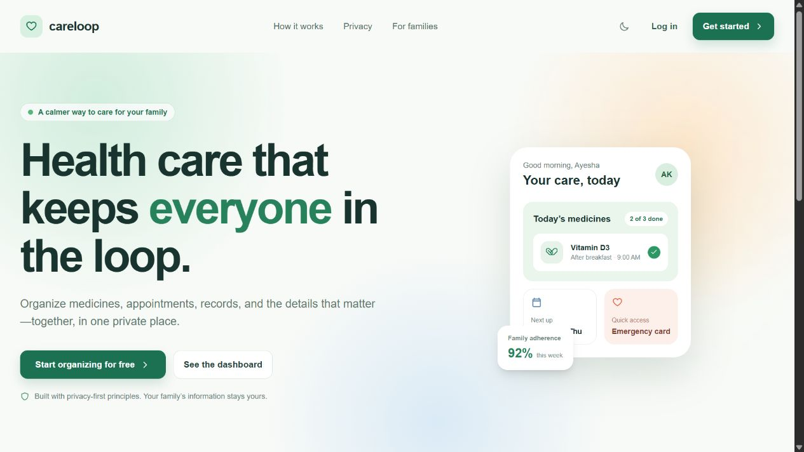
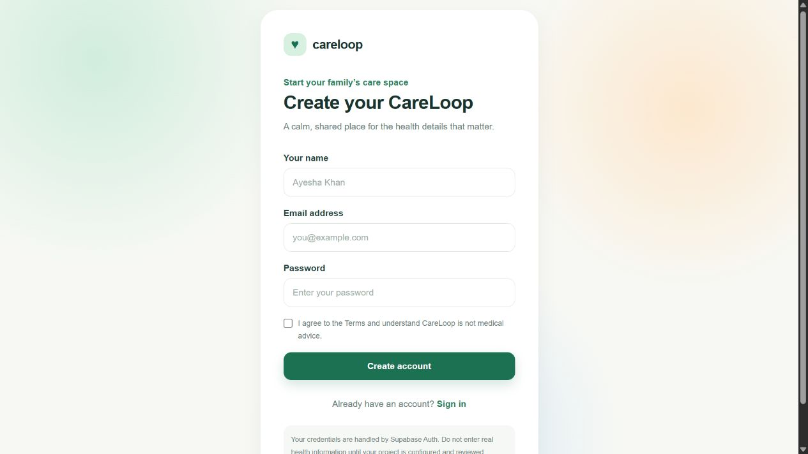

# CareLoop

> A privacy-first family health organizer for keeping health information, medicines, appointments, documents, emergency details, and caregiver access in one calm, secure workspace.

<p align="center">
  <a href="https://careloop-xi.vercel.app"><strong>View the live application</strong></a>
  &nbsp;·&nbsp;
  <a href="#what-it-includes">Explore features</a>
  &nbsp;·&nbsp;
  <a href="#local-setup">Run locally</a>
</p>

CareLoop helps households organize health information without presenting itself as a replacement for a clinician, emergency service, or professional medical advice. It is built with a mobile-first experience, clear consent boundaries, and strong household-level authorization in mind.

## Product preview

| Calm family-health home | Clear, accessible account setup |
| --- | --- |
|  |  |

Screenshots use fictional interface content only. Never add real family or health information to repository images.

## What it includes

- Family profiles with allergies, conditions, emergency contacts, insurance notes, and health notes.
- Granular caregiver invitations and revocable permissions.
- Medicine schedules, adherence logging, refill awareness, and reminder preferences.
- Personal appointment tracking with calendar and health-timeline views.
- A private medical-record vault for documents, PDFs, and images.
- Emergency profiles, privacy-safe QR sharing, and a mobile emergency card.
- Consent-gated AI workflow foundations for prescription scanning and report explainers.
- Privacy controls, account-data export, deletion requests, audit records, and a protected internal admin shell.

## Safety and privacy principles

- CareLoop does **not** provide medical diagnosis, treatment recommendations, or emergency guidance.
- AI-assisted features are informational only, require explicit consent, and never add medicines automatically.
- The database migrations apply household-scoped Row Level Security policies. Always review and test these policies in your own Supabase project before launch.
- Documents are designed for private storage and signed access; they must never be placed in public storage buckets.
- This project does **not** claim HIPAA or any other legal compliance. Obtain independent legal, privacy, and security review before a public health-data launch.

## Technology

- [Next.js 16](https://nextjs.org/) with the App Router and TypeScript
- Tailwind CSS and accessible, reusable UI patterns
- Supabase Auth, Postgres, Row Level Security, and Storage
- Zod validation, QR-code support, and production-oriented security headers

## Local setup

### 1. Install dependencies

```bash
npm install
```

### 2. Configure environment variables

Copy the template and add your Supabase project values:

```bash
Copy-Item .env.example .env.local
```

Required values:

```env
NEXT_PUBLIC_SUPABASE_URL=https://your-project.supabase.co
NEXT_PUBLIC_SUPABASE_PUBLISHABLE_KEY=your-anon-or-publishable-key
```

Never commit `.env.local`, service-role keys, real health data, or production exports.

### 3. Apply the database schema

Run the SQL migrations in `supabase/migrations/` against a new Supabase project, in filename order. The detailed process is in [SUPABASE_SETUP.md](./SUPABASE_SETUP.md).

### 4. Start the app

```bash
npm run dev
```

Open [http://localhost:3000](http://localhost:3000).

## Quality checks

```bash
npm run lint
npm run release:check
npm run build
```

## Deployment

Deploy to Vercel or another Next.js-compatible host. Configure the Supabase environment variables in the hosting provider before promoting a deployment. Review [LAUNCH_CHECKLIST.md](./LAUNCH_CHECKLIST.md) and [QA_REPORT.md](./QA_REPORT.md) first.

The public landing page can be viewed without an account; authenticated health data workflows require a configured Supabase project. Do not treat a deployment without Supabase configuration as a production-ready health application.

## Project references

- [Supabase setup guide](./SUPABASE_SETUP.md)
- [Release and launch checklist](./LAUNCH_CHECKLIST.md)
- [QA report](./QA_REPORT.md)

## License and legal review

No open-source license has been selected yet. Before accepting contributions or publicly launching, select an appropriate license and obtain legal review of the draft Privacy Policy, Terms of Service, Medical Disclaimer, and Cookie Notice included in the app.
